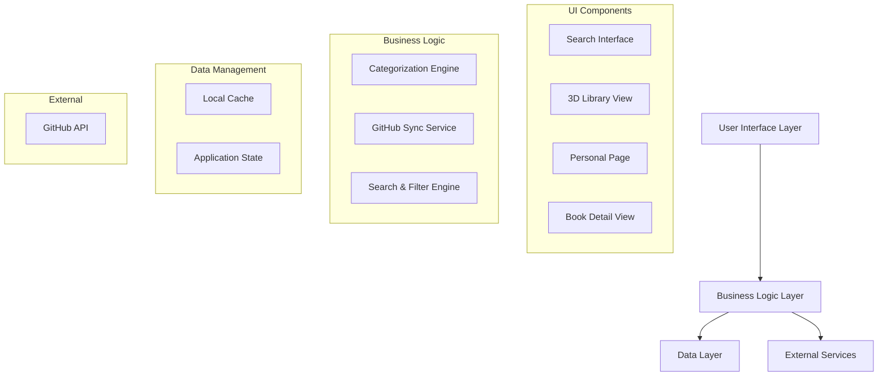

# Design Document

## Overview

The GitHub Library System transforms the existing Books OS application into a comprehensive library management system where GitHub repositories are treated as "Books". The system provides library-style categorization, search functionality, and personal publishing management while maintaining the existing 3D library interface and adding new search capabilities.

## Architecture

### High-Level Architecture



### Data Flow

1. **GitHub Sync**: Repositories are fetched from GitHub API and automatically categorized
2. **Book Processing**: Each repository becomes a "Book" with README as description
3. **Search & Filter**: Real-time filtering and search across all books
4. **Personal Management**: User-specific views and publishing management

## Components and Interfaces

### Core Components

#### 1. Book Management System

**BookService**
```typescript
interface BookService {
  fetchGitHubRepositories(username?: string): Promise<Book[]>
  categorizeBook(repository: GitHubRepository): BookCategory
  syncBooks(): Promise<void>
  getBooksByCategory(category: string): Book[]
  searchBooks(query: SearchQuery): Book[]
}
```

**Book Interface** (extends existing ProjectItem)
```typescript
interface Book extends ProjectItem {
  githubUrl: string
  readme?: string
  isPrivate: boolean
  language: string
  stars: number
  forks: number
  lastUpdated: Date
  category: BookCategory
  author: string
  contributors?: string[]
}
```

#### 2. Search and Filter System

**SearchEngine**
```typescript
interface SearchEngine {
  search(query: string, filters: SearchFilters): Book[]
  getAvailableFilters(): FilterOptions
  getSuggestions(partialQuery: string): string[]
}

interface SearchFilters {
  categories?: string[]
  authors?: string[]
  languages?: string[]
  dateRange?: DateRange
  visibility?: 'public' | 'private' | 'all'
  sortBy?: 'relevance' | 'date' | 'popularity' | 'alphabetical'
}
```

#### 3. Categorization Engine

**CategoryService**
```typescript
interface CategoryService {
  categorizeRepository(repo: GitHubRepository): BookCategory
  getCategories(): Category[]
  updateCategoryRules(rules: CategoryRule[]): void
}

interface CategoryRule {
  keywords: string[]
  filePatterns: string[]
  languagePatterns: string[]
  category: BookCategory
  confidence: number
}
```

#### 4. Personal Publishing System

**PersonalLibrary**
```typescript
interface PersonalLibrary {
  getUserBooks(userId: string): Book[]
  getPublishedBooks(userId: string): Book[]
  updateBookMetadata(bookId: string, metadata: BookMetadata): void
  toggleBookVisibility(bookId: string): void
}
```

### UI Components

#### 1. Enhanced Search Interface

**SearchBar Component**
- Real-time search with debouncing
- Auto-suggestions and search history
- Advanced filter panel
- Keyboard shortcuts (⌘K for focus)

**FilterPanel Component**
- Category checkboxes with counts
- Author multi-select
- Language filter
- Date range picker
- Sort options

#### 2. Book Detail View

**BookViewer Component**
- README display as main content
- Repository metadata sidebar
- Related books suggestions
- Public/Private indicator
- Direct GitHub link

#### 3. Personal Dashboard

**PersonalPage Component**
- User's published books grid
- Publishing statistics
- Book management tools
- Privacy controls

#### 4. Enhanced Library Views

**CategoryShelf Component** (extends existing ShelfRow)
- Category-based organization
- Book count indicators
- Drag-and-drop reorganization

## Data Models

### Enhanced Book Model

```typescript
interface Book {
  // Existing ProjectItem fields
  id: string
  title: string
  subtitle?: string
  emoji?: string
  color?: string
  sectionId: string
  ownerId: string
  ownerName: string
  isPublic: boolean
  likes: number
  
  // GitHub-specific fields
  githubUrl: string
  githubId: number
  readme?: string
  description?: string
  language: string
  stars: number
  forks: number
  watchers: number
  issues: number
  pullRequests: number
  lastCommit: Date
  createdAt: Date
  updatedAt: Date
  
  // Library-specific fields
  category: BookCategory
  tags: string[]
  author: string
  contributors: string[]
  license?: string
  topics: string[]
  isArchived: boolean
  size: number // Repository size in KB
}
```

### Category System

```typescript
enum BookCategory {
  GAMES = 'games',
  WEB_APPS = 'web-applications',
  MOBILE_APPS = 'mobile-applications',
  SOCIAL_MEDIA = 'social-media',
  PRODUCTIVITY = 'productivity-tools',
  AI_ML = 'ai-machine-learning',
  UI_DESIGN = 'ui-ux-design',
  GRAPHICS = 'graphics-visual-arts',
  TUTORIALS = 'tutorials-guides',
  DOCUMENTATION = 'technical-documentation',
  BUSINESS = 'business-strategy',
  RESEARCH = 'research-analysis',
  UTILITIES = 'utilities',
  EDUCATIONAL = 'educational',
  SELF_HELP = 'self-help',
  MISCELLANEOUS = 'miscellaneous'
}

interface Category {
  id: BookCategory
  name: string
  description: string
  color: string
  icon: string
  keywords: string[]
  languageHints: string[]
  filePatterns: string[]
}
```

### Search Models

```typescript
interface SearchQuery {
  text: string
  filters: SearchFilters
  sortBy: SortOption
  limit?: number
  offset?: number
}

interface SearchResult {
  books: Book[]
  totalCount: number
  facets: SearchFacets
  suggestions: string[]
}

interface SearchFacets {
  categories: { [key: string]: number }
  authors: { [key: string]: number }
  languages: { [key: string]: number }
  years: { [key: string]: number }
}
```

## Error Handling

### GitHub API Integration

1. **Rate Limiting**: Implement exponential backoff and request queuing
2. **Authentication Errors**: Graceful fallback to public repositories only
3. **Network Failures**: Offline mode with cached data
4. **Repository Access**: Handle private repository permissions

### Search and Filtering

1. **Invalid Queries**: Sanitize input and provide helpful error messages
2. **No Results**: Suggest alternative searches and filters
3. **Performance**: Implement search result pagination and lazy loading

### Data Synchronization

1. **Sync Failures**: Retry mechanism with user notification
2. **Data Conflicts**: Last-write-wins with user override option
3. **Storage Limits**: Implement data cleanup and archiving

## Testing Strategy

### Unit Testing

1. **CategoryService**: Test automatic categorization logic
2. **SearchEngine**: Test search algorithms and filtering
3. **BookService**: Test GitHub API integration and data transformation
4. **PersonalLibrary**: Test user-specific functionality

### Integration Testing

1. **GitHub API Integration**: Test with real GitHub repositories
2. **Search Performance**: Test with large datasets
3. **Sync Process**: Test full synchronization workflow
4. **User Workflows**: Test complete user journeys

### Component Testing

1. **Search Interface**: Test search interactions and results display
2. **Book Detail View**: Test README rendering and metadata display
3. **Personal Dashboard**: Test book management functionality
4. **Library Views**: Test enhanced categorization and navigation

### Performance Testing

1. **Search Response Time**: Target <200ms for typical queries
2. **Sync Performance**: Test with repositories containing 1000+ books
3. **Memory Usage**: Monitor memory consumption during large operations
4. **Rendering Performance**: Test 3D library with many books

## Implementation Phases

### Phase 1: Core Infrastructure
- GitHub API integration
- Basic book model and data transformation
- Enhanced search functionality

### Phase 2: Categorization System
- Automatic categorization engine
- Category management interface
- Enhanced library organization

### Phase 3: Personal Publishing
- Personal dashboard
- Book management tools
- Privacy controls

### Phase 4: Advanced Features
- README rendering and display
- Related books suggestions
- Advanced search filters

### Phase 5: Performance and Polish
- Search optimization
- Caching improvements
- UI/UX enhancements